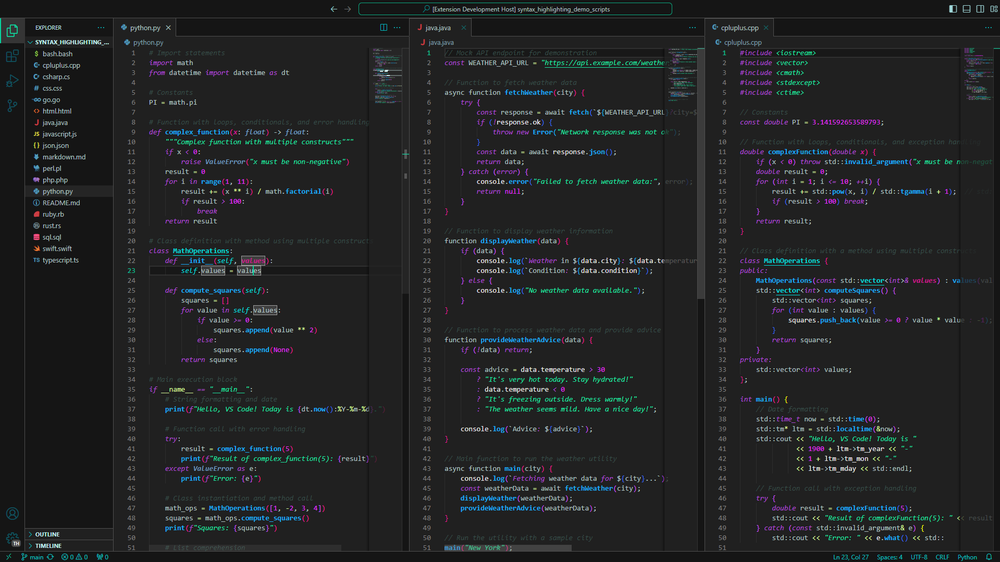
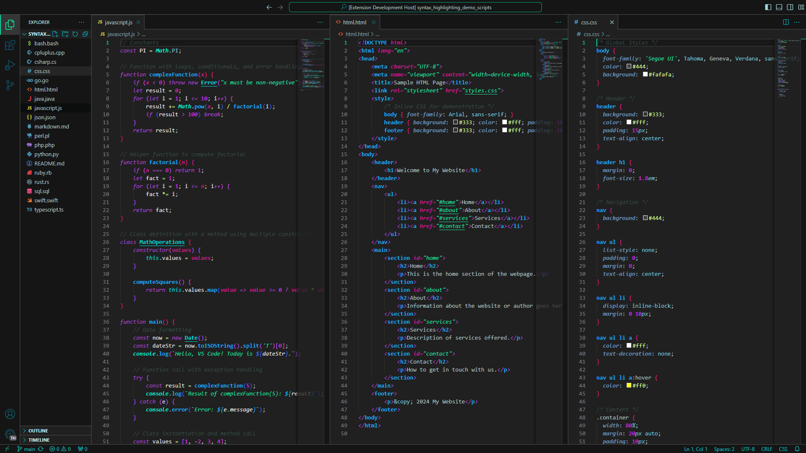
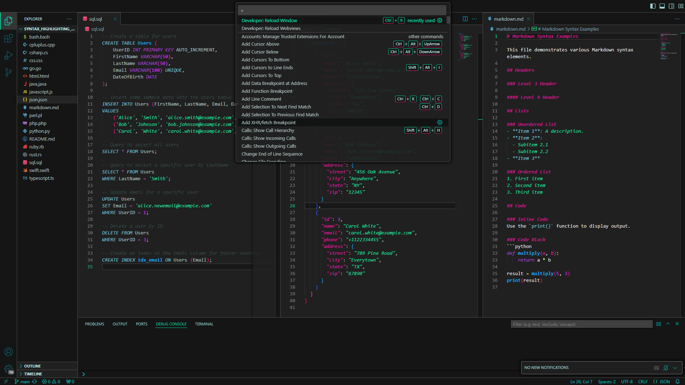

# cyberspace_color_theme
A dark gray and cyan Theme with neon accent colors.

---

## Install
**1.** Open the *Extensions* Tab in *Visual Studio Code* or go to the [*VS Marketplace*](https://marketplace.visualstudio.com/items?itemName=OmegaDawn.cyberspace)  
**2.** Search for `Cyberspace`  
**3.** Install the Theme  
**4.** Select the Theme in the Color Theme menu with `Ctrl + K` `Ctrl + T`

## Tweaks
For a better immersion into the '*cyberspace*' the following extensions can be tweaked to fit the Theme.
These tweaks should be added to the user settings file. *(Open this file by pressing  `Ctrl + Shift + P` search for '`Open User Settings (JSON)`')*

| Extension | Tweak |
| - | - |
[indent-rainbow](https://marketplace.visualstudio.com/items?itemName=oderwat.indent-rainbow) |  <pre>"indentRainbow.indicatorStyle": "light", "indentRainbow.errorColor": "rgba(240,48,80,0.5)", "indentRainbow.colors": [     "rgba(243,18,153,0.7)",     "rgba(207,85,255,0.7)",     "rgba(61,113,255,0.7)",     "rgba(18,186,253,0.7)",     "rgba(6,238,222,0.7)",     "rgba(6,221,139,0.7)", ]</pre> |
| [Todo Tree](https://marketplace.visualstudio.com/items?itemName=Gruntfuggly.todo-tree) | <pre>"todo-tree.highlights.defaultHighlight": {     "background": "#000000",     "foreground": "#00ffbf", }</pre> |
| [Error Lens](https://marketplace.visualstudio.com/items?itemName=usernamehw.errorlens) | <pre>"errorLens.hintGutterIconColor": "#43d6ff", "errorLens.infoGutterIconColor": "#43d6ff"</pre> |
| [Bookmarks](https://marketplace.visualstudio.com/items?itemName=alefragnani.Bookmarks) | Changes in *'Extension Settings'*<ul><li>**Gutter Icon Border Color:** `#00ddff`</li><li>**Gutter Icon Fill Color:**`#00ddff`</li></ul>
|  [GitLens](https://marketplace.visualstudio.com/items?itemName=eamodio.gitlens) | *Tweaked colors already included in Theme*

 
 

| Other settings | Tweak |
| - | - |
| `editor.rulers`  *(Python)* | <pre>"[python]": {     "editor.rulers": [         {             "column": 72,             "color": "#50505030"         },         {             "column": 79,             "color": "#505050fe"         }     ] }</pre> |

---
---

## Repository
https://github.com/OmegaDawn/cyberspace_color_theme

## Credits
The showcased languages files: \
    https://github.com/OmegaDawn/syntax_highlighting_demo_files

The theme is based on these color pallets: \
    https://coolors.co/palette/ef476f-ffd166-06d6a0-118ab2-073b4c \
    https://coolors.co/palette/f72585-7209b7-3a0ca3-4361ee-4cc9f0 \
    https://coolors.co/palette/9b5de5-f15bb5-fee440-00bbf9-00f5d4
